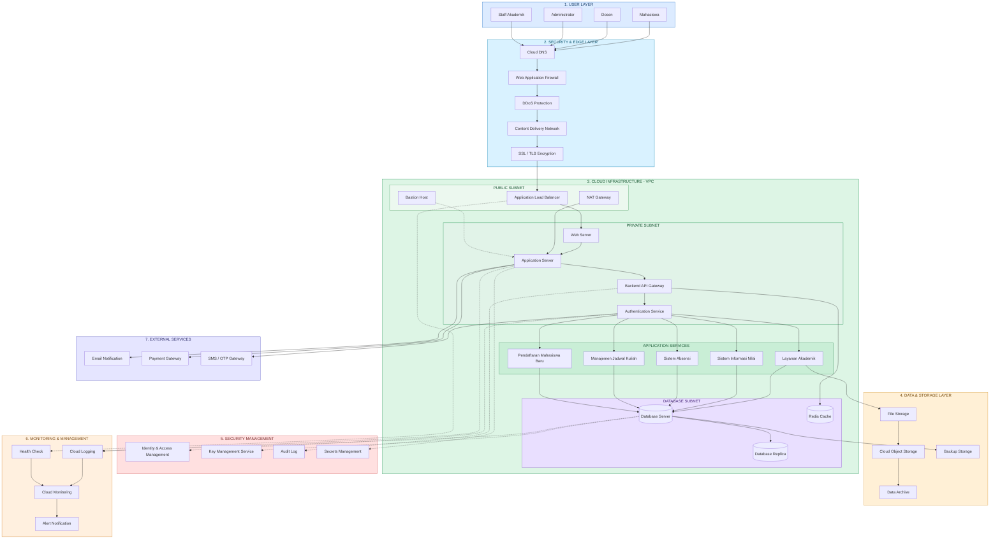

# DIAGRAM ARSITEKTUR CLOUD SISTEM INFORMASI KAMPUS

Diagram ini menggambarkan infrastruktur cloud untuk sistem informasi layanan kampus yang digunakan oleh mahasiswa, dosen, dan administrator.

```mermaid
flowchart TD

    %% ==================================
    %% 1. USER LAYER
    %% ==================================
    subgraph USERS["1. USER LAYER"]
        M["Mahasiswa"]
        D["Dosen"]
        ADM["Administrator"]
        STAFF["Staff Akademik"]
    end

    %% ==================================
    %% 2. SECURITY AND EDGE LAYER
    %% ==================================
    subgraph EDGE["2. SECURITY & EDGE LAYER"]
        DNS["Cloud DNS"]
        WAF["Web Application Firewall"]
        DDOS["DDoS Protection"]
        CDN["Content Delivery Network"]
        SSL["SSL / TLS Encryption"]
    end

    %% ==================================
    %% 3. CLOUD INFRASTRUCTURE
    %% ==================================
    subgraph VPC["3. CLOUD INFRASTRUCTURE - VPC"]

        subgraph PUBLIC["PUBLIC SUBNET"]
            ALB["Application Load Balancer"]
            NAT["NAT Gateway"]
            BASTION["Bastion Host"]
        end

        subgraph PRIVATE["PRIVATE SUBNET"]
            WEB["Web Server"]
            APP["Application Server"]
            API["Backend API Gateway"]
            AUTH["Authentication Service"]
        end

        subgraph SERVICES["APPLICATION SERVICES"]
            AKADEMIK["Layanan Akademik"]
            NILAI["Sistem Informasi Nilai"]
            ABSEN["Sistem Absensi"]
            JADWAL["Manajemen Jadwal Kuliah"]
            PMB["Pendaftaran Mahasiswa Baru"]
        end

        subgraph DATABASE["DATABASE SUBNET"]
            DB[("Database Server")]
            CACHE[("Redis Cache")]
            REPLICA[("Database Replica")]
        end
    end

    %% ==================================
    %% 4. STORAGE LAYER
    %% ==================================
    subgraph STORAGE["4. DATA & STORAGE LAYER"]
        OBJECT["Cloud Object Storage"]
        FILES["File Storage"]
        BACKUP["Backup Storage"]
        ARCHIVE["Data Archive"]
    end

    %% ==================================
    %% 5. SECURITY MANAGEMENT
    %% ==================================
    subgraph SECURITY["5. SECURITY MANAGEMENT"]
        IAM["Identity & Access Management"]
        KEY["Key Management Service"]
        AUDIT["Audit Log"]
        SECRETS["Secrets Management"]
    end

    %% ==================================
    %% 6. MONITORING
    %% ==================================
    subgraph MONITOR["6. MONITORING & MANAGEMENT"]
        LOG["Cloud Logging"]
        METRIC["Cloud Monitoring"]
        ALERT["Alert Notification"]
        HEALTH["Health Check"]
    end

    %% ==================================
    %% 7. EXTERNAL SERVICES
    %% ==================================
    subgraph EXTERNAL["7. EXTERNAL SERVICES"]
        EMAIL["Email Notification"]
        PAYMENT["Payment Gateway"]
        SMS["SMS / OTP Gateway"]
    end

    %% ==================================
    %% USER CONNECTIONS
    %% ==================================
    M --> DNS
    D --> DNS
    ADM --> DNS
    STAFF --> DNS

    %% ==================================
    %% EDGE CONNECTIONS
    %% ==================================
    DNS --> WAF
    WAF --> DDOS
    DDOS --> CDN
    CDN --> SSL
    SSL --> ALB

    %% ==================================
    %% INFRASTRUCTURE CONNECTIONS
    %% ==================================
    ALB --> WEB
    WEB --> APP
    APP --> API
    API --> AUTH

    %% ==================================
    %% APPLICATION SERVICES
    %% ==================================
    AUTH --> AKADEMIK
    AUTH --> NILAI
    AUTH --> ABSEN
    AUTH --> JADWAL
    AUTH --> PMB

    %% ==================================
    %% DATABASE CONNECTIONS
    %% ==================================
    AKADEMIK --> DB
    NILAI --> DB
    ABSEN --> DB
    JADWAL --> DB
    PMB --> DB

    API --> CACHE
    DB --> REPLICA

    %% ==================================
    %% STORAGE CONNECTIONS
    %% ==================================
    DB --> BACKUP
    AKADEMIK --> FILES
    FILES --> OBJECT
    OBJECT --> ARCHIVE

    %% ==================================
    %% SECURITY CONNECTIONS
    %% ==================================
    AUTH -.-> IAM
    DB -.-> KEY
    APP -.-> SECRETS
    API -.-> AUDIT

    %% ==================================
    %% MONITORING CONNECTIONS
    %% ==================================
    APP -.-> LOG
    DB -.-> LOG
    ALB -.-> HEALTH
    LOG --> METRIC
    HEALTH --> METRIC
    METRIC --> ALERT

    %% ==================================
    %% EXTERNAL INTEGRATIONS
    %% ==================================
    APP --> EMAIL
    APP --> PAYMENT
    AUTH --> SMS

    %% ==================================
    %% NETWORK MANAGEMENT
    %% ==================================
    NAT --> APP
    BASTION -.-> APP

    %% ==================================
    %% STYLING
    %% ==================================
    style USERS fill:#DCEBFF,stroke:#2878C8,color:#123B68
    style EDGE fill:#D9F2FF,stroke:#1687B5,color:#07516D
    style VPC fill:#DDF5E5,stroke:#29965A,color:#14552F
    style PUBLIC fill:#ECF8EF,stroke:#54A66C,color:#14552F
    style PRIVATE fill:#E1F3E8,stroke:#29965A,color:#14552F
    style SERVICES fill:#C9EED6,stroke:#23834A,color:#14552F
    style DATABASE fill:#E9DFFF,stroke:#8756C5,color:#48277A
    style STORAGE fill:#FFF0D6,stroke:#D99A35,color:#754A0B
    style SECURITY fill:#FFE0E0,stroke:#D65A5A,color:#782727
    style MONITOR fill:#FFF0DF,stroke:#D68B36,color:#75430D
    style EXTERNAL fill:#E5E5FF,stroke:#6868C8,color:#33336F
```
